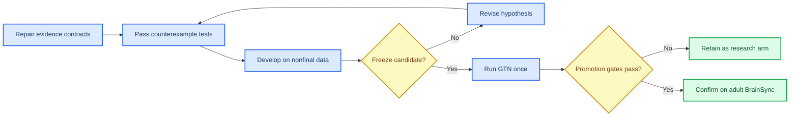

# N2P3-Net 深度模型研究方向与 GTN 最终验证方案

状态：2026-08-28 日期化深度研究报告/证据附录。唯一 living guide 为
[`research_program.zh.md`](research_program.zh.md)；冲突时以后者和可执行代码为准。

_研究分支审计、外部文献检索与可证伪实验设计，2026-08-28_

---

## 摘要

当前 N2P3-Net 的可执行身份是 **MS-EEGNet 式紧凑 CNN**，不是旧的 gated reference、tokenizer、TCN 或 PCW 路线。BI2014a 的完整 64 被试 LOSO 结果表明：保留主干全部 32 Hz 时间坐标的 `full_unfold` 比固定 250 ms 二级平均池化更有希望，而低秩二阶头和同预算 MLP 没有提供稳定增益。因此下一步不应继续加深网络，首要矛盾是三个目标错位：单试次交叉熵与最终候选选择错位、固定位置模板与 P300 时延漂移错位、独立 logit 求和与重复试次相关性错位。

推荐主路线是：保留紧凑主干，以 `full_unfold_k35` 作为待确认的开发候选，依次检验候选集前缀损失、受限时移边缘化和相关性感知的序贯证据。监督式 episodic transfer 比当前 masked reconstruction 更贴近最终任务；SSL 只有在 masked-region loss、源目标隔离和归一化契约闭合后才值得进入比较。LMBC 在 BI2014a 当前配方下不晋升，但这不能否定时延边缘化本身，因为现实现的特征时间窗没有原始信号域的局部性保证。

GTN 必须是最终模型裁决数据，但要拆成两项实验：完全留出目标被试的 GTN-LOSO 用于跨被试模型确认；同一被试 prefix 到 suffix 的因果协议用于校准/迁移。后者的旧事件表显示 `M=8,R=8` 仅约 29 个 selection 可满足严格时间隔离，不能作为全体主 estimand。GTN 又是 3 导、7-17 岁学龄人群，而项目 mission 写的是成人、主要 8 导，所以 GTN 最终结果只能确认 GTN benchmark，不能单独证明 BrainSync 成人部署有效。

## 1. 证据边界

本报告审计的是 `research/n2p3-transfer-ssl@17c2652` 及其当前未提交修正，不是只有初始提交的 `main@b33d783`。证据分为四层：

| 等级 | 证据 | 可支持的表述 |
|---|---|---|
| A | 同缓存、同 folds、同 QC 的完整 BI2014a matched records | 该数据和配方下的局部模型排序 |
| B | 直接 P300/ERP 多被试论文及可核验全文 | 机制先例、反例和设计边界 |
| C | 2025-2026 预印本、跨范式 EEG 论文 | 候选假设，不是性能承诺 |
| D | 合成张量、Monte Carlo、理论反例 | 实现性质，不是现实 EEG 增益 |

外部检索截至 2026-08-28。可访问 PDF、DOI/arXiv 标识、搜索范围和失败项见 [文献清单](../Paper/literature_manifest_20260828.md)。Parallel 深度检索因本机未认证而未执行；开放数据库检索不是 PRISMA 系统综述，也不能证明“未检索到”就是不存在。

## 2. 当前模型与现有结果

### 2.1 当前 trunk 的数学对象

设输入为 `X in R^(B x C x 128)`。当前主干依次执行：

1. 8 个长度 `k0` 的共享时间卷积；
2. 每个时间滤波器上的 depthwise 空间投影，深度乘子为 2；
3. 4 点平均池化，时间采样率由 128 Hz 变为 32 Hz；
4. 两个长度 `k1=5`、`k2=17` 的 depthwise 时间分支，各压缩为 2 个特征；
5. 拼接为 `H in R^(B x 4 x 32)`。

`ms_flatten` 再做 8 点平均池化，得到 `4 x 4 = 16` 个 readout 特征；`full_unfold` 暴露全部 `4 x 32 = 128` 个坐标。实现位于 [n2p3net.py](../src/models/n2p3net.py)。

一条分支在输入 sample 轴上的总感受野为

```text
R_s = k0 + (p - 1) + (k_s - 1) p,  p = 4.
```

默认 `k0=65` 时，两个分支的 `R_s` 分别为 84 和 132 samples，对应 endpoint span 约 648 和 1023 ms。`k0=35` 时降为 54 和 102 samples，约 414 和 789 ms。这个计算说明“卷积后某个时间点”不能自动解释为原始信号的窄生理窗口。

### 2.2 BI2014a 能支持什么

完整 matched head ablation 的四个 arm 都有 64 folds 和 61,015 个 held-out trials：

| 模型 | 参数 | AUC | BACC | 证据状态 |
|---|---:|---:|---:|---|
| EEGNet | 1,490 | 0.73955 | 0.67541 | 当前单语料整体基线 |
| MS-EEGNet `ms_flatten` | 1,282 | 0.73484 | 0.66740 | 当前 trunk 基线 |
| LMBC | 1,262 | 0.72421 | 0.65904 | 该配方不晋升 |
| global average | 1,258 | 0.67143 | 0.61720 | 位置丢失负对照 |

后续 prior-free matched run 得到：

| readout | AUC | BACC | 相对 `ms_flatten` |
|---|---:|---:|---|
| `full_unfold` | 0.74511 | 0.67741 | AUC `+0.01090`，BACC `+0.00963` |
| quadratic unfold | 0.74075 | 0.67556 | 低于线性 unfold |
| MLP unfold | 0.74403 | 0.67529 | 未超过线性 unfold |

逐被试重算显示，`full_unfold - ms_flatten` 的 AUC 95% bootstrap CI 为 `[+0.00339,+0.01816]`，BACC CI 为 `[+0.00260,+0.01657]`。相对 EEGNet，AUC 差为 `+0.00560`，CI `[+0.00046,+0.01059]`，但 BACC CI 跨 0。随后同一批外层被试又被用于 epoch、patience、采样率和 kernel 搜索，所以这些 p 值和 CI 只能描述开发轨迹，不能再当 untouched confirmation。

最稳妥的局部判断是：**保留时间坐标比增加 readout 非线性更值得继续研究**。它不证明 `full_unfold_k35` 已经优于 EEGNet，也不证明 LMBC 的理念错误。紧凑 EEGNet 和少滤波器 CNN 本来就是 P300 的强基线；MS-EEGNet 在不同 oddball 数据上的优势也并不一致。[^1][^2][^3]

### 2.3 当前证据缺口

- 当前合同下没有 matched `xDAWN-RG` 和 regularized linear 完整 record，却已使用“promoted”措辞
- 本地 GTN 只有旧 256 Hz cache，没有 v4 attestation，也没有当前合同的完整 GTN `record.json`
- k35 是开发候选，没有独立最终数据的确认记录
- records 缺 outer logits、fold-subject 映射、直接 cache/raw hash、dirty diff hash、完整包版本和 batch-1 latency
- GTN 原始 metadata 只有 22/249 个 TXT 明确写 nose reference，其余未说明，不能被一个非空哨兵字符串变成共同参考
- GTN 本地年龄为 7-17 岁，而 [mission.md](mission.md) 的目标人群是成人 EEG；GTN 原论文同样把它描述为 school-age children 数据集。[^4]

## 3. 对契约和指导文件的批判

### 3.1 “契约”混合了事实、配方和假设

当前 `EEGDataContract` 把 128 Hz、2-30 Hz、IIR4、epoch-domain FFT resampling、`[-200,800)` 和 mean baseline 绑定为一个“data truth”，见 [contract.py](../src/data/contract.py)。这些值中，单位、源事件和采集采样率属于事实；滤波、重采样、epoch 和 baseline 属于待消融配方；kernel sample 数属于模型几何。三者不应同生共死。

建议拆成四个对象：

| 对象 | 只应拥有的字段 | 不应拥有的字段 |
|---|---|---|
| `AcquisitionEvidenceContract` | raw/event hash、源采样率、单位、通道顺序、reference/ground、坐标系、设备/会话 | 训练滤波和模型 kernel |
| `AnalysisRecipe` | filter、baseline、epoch、resample、QC 规则及版本 | 原始采集事实 |
| `ModelGeometry` | 物理感受野、kernel/pool 派生、特征时间中心 | 数据集 reference |
| `EvaluationProtocol` | split unit、eligibility、calibration、候选集、R、metrics、seed、停止规则 | 模型默认值 |

GTN contract 目前只是通用 P300 contract 换名。128 Hz 和 2 Hz 高通可以是主 recipe，但在没有 GTN matched ablation 前不能称为 GTN 的物理真理。

### 3.2 constitution 应是治理边界，不是模型教条

[constitution.md](constitution.md) 中以下原则应保留：group-held-out evidence、train-only preprocessing/calibration、同配方 classical baselines、成本报告。以下条款应降级：

- P6 的“每个 epoch 一个 logit，再按候选求和”应定义为必备 baseline interface，不应禁止 candidate-set model
- P2 在没有当前合同的 xDAWN-RG/linear record 时不能宣称已经满足
- “sole project contract”不能覆盖实证上仍待验证的 recipe
- `configs/default.yaml` 没有消费者，Hydra 也不是依赖，不能继续称 Hydra 驱动；argparse runner 才是当前 executable truth

### 3.3 指导文件领先于实现

迁移文档承诺的 masked-only reconstruction、subject identity audit、MMD、三种 calibration、dynamic stopping、xDAWN/EEGNet controls 目前没有形成一个闭合 runner。尤其是：

- pretraining loss 对整个 epoch 计分，不只计 masked region，允许 visible-copy shortcut
- subject probe loss 没有进入 total，runner 也未形成独立 audit record
- 预训练默认 raw volts，下游 adapter 无条件 target-prefix standardization，冻结 trunk 的输入分布不一致
- adapter 暴露 calibration logits，但 transfer runner 未实际拟合并应用校准后证据
- 同人协议虽已修正为统一时间 embargo，仍需把所有 excluded groups 和原因写进最终 record

在这些问题解决前，不应启动可对外解释的 SSL/transfer 实验。

## 4. 第一优先创新：候选集与前缀目标

### 4.1 理念

最终任务不是判断一个 trial 是否含 P300，而是在 9 个候选中选择一个目标，并希望少 repetition 即可正确。训练只优化独立 trial CE，等价于假设“单 trial 排序改善必然转化为 hit@R 改善”；这在校准漂移、候选相关和 trial 数不齐时不成立。

### 4.2 数学概念与公式

对 selection `g`、候选 `d`、repetition `r`，令紧凑 trunk 输出

```text
h_gdr = F_theta(x_gdr).
```

在同一 repetition 内先形成 permutation-equivariant context：

```text
c_gr = (1/K) sum_j h_gjr,
ell_gdr = q_psi(h_gdr, h_gdr - c_gr, qc_gdr).
```

前 `R` 次证据和候选 posterior 为

```text
S_gd^(R) = sum_(r<=R) ell_gdr,
p_gd^(R) = softmax_d(S_gd^(R) / tau_R).
```

候选集损失为

```text
L_set = - sum_g sum_(R in R_train) omega_R log p_g,d*(R).
L = lambda_trial L_trial + lambda_set L_set.
```

`L_trial` 保留单 trial 判别与通用 baseline 可比性；`L_set` 直接对齐 hit@R。`tau_R`、`omega_R` 和 `lambda` 只能在 inner groups 上冻结。

### 4.3 可区分预测与反例

- 若增益来自候选上下文，打乱 selection group 后增益应消失
- 若增益只是增加参数，同预算的 independent MLP 应得到相似结果
- 将 candidate code 在每个 group 内随机重命名后性能应保持；否则模型学了数字先验
- 当每个候选 repetition 数相等时，共同正仿射校准不能改变 argmax：`S'_d=aS_d+Rb`。如果只加 Platt 就声称 hit 提升，应先检查 trial 数不齐、threshold 或实现差异
- 如果 `L_set` 提高 hit@R 但显著降低 macro AUC/ECE，应报告为任务特化 tradeoff，不称普遍表示更好

### 4.4 整个代码链

`events.py` 的 candidate/group/repetition ledger -> group-aware batch sampler -> `N2P3Net.forward_features` -> 新的 set loss -> train-only candidate calibration -> `hit@R`/outer predictions。单 trial baseline 路径保持不变，确保净效应可归因。

## 5. 第二优先创新：局部、可平移的形态模板

### 5.1 理念

`ms_flatten` 对约 250 ms bin 内的位置不敏感，但不可逆地丢失形态；`full_unfold` 保留 31.25 ms 坐标，却对小幅时移敏感。需要的是有限范围内的平移容忍，而不是全局平均或固定 P300 window。

单试次 P300 latency realignment 的研究说明时延变异值得显式建模，但 realignment 改善波形不等于自动改善 held-out 分类。[^5]

### 5.2 数学概念与公式

在具有明确原始信号感受野的局部特征上定义模板匹配：

```text
a_delta = sum_(s,t in W) w_st h_s(t + delta),
ell = tau log sum_(delta in Delta) pi_delta exp(a_delta / tau).
```

`Delta` 是预注册的有限 shift bank，例如 `{-40,-20,0,20,40} ms`；`pi_delta` 可固定均匀或由 training fold 学得。还应输出

```text
p(delta | x) = softmax_delta(a_delta / tau)
```

及其 entropy，作为“模型是否依赖不可识别时延”的审计量。

### 5.3 必须先满足的局部性

对 centered convolution，只有当一个 feature 的完整感受野落在声明窗口内，才可把它解释为该窗口证据。默认长分支 1023 ms 感受野覆盖几乎整个 epoch，所以现 LMBC 的 encoded `[-200,0)` reference 会混入刺激后样本。未来实现应使用更短的 valid/local branch，或在 raw/spatially-projected signal 上做 template bank；不能只改 feature timestamp 标签。

### 5.4 反例

- 同一 ERP 平移 20-40 ms：固定 unfold 退化，shift bank 应保持
- 同一池化 bin 内 N200/P300 相消：average collision，unfold/shift template 应区分
- evidence window 内加入大眼动脉冲：无质量约束的 max/logsumexp 会选伪迹
- 真实 latency 超出 `Delta`：模型应高 entropy 或 abstain，而不是自信错误
- 只保留 pre-stim features 仍高于 chance：提示 reference、filter 或 label leakage

### 5.5 代码链

只替换 [n2p3net.py](../src/models/n2p3net.py) 的 readout hypothesis；trunk、训练预算、calibration 和 candidate aggregation保持 matched。必须记录实际 RF、active shifts、posterior entropy 和 jitter stress curve。

## 6. 第三优先创新：相关性感知的序贯证据

### 6.1 理念

当前 calibrated LLR 求和隐含条件独立。P300 repetitions 会受注意、疲劳、同一 session 噪声和伪迹共同影响；直接求和可能排序尚可，但 posterior 过度自信，dynamic stopping 过早。

Bayesian P300 uncertainty、Bayesian signal matching 和 xDAWN-Riemann transfer 提供了直接先例，但它们的模型和指标不能直接替代本项目 matched 实验。[^6][^7][^8]

### 6.2 数学概念与公式

若同一候选的 `R` 个证据具有等相关 `rho`，有效独立样本量近似

```text
R_eff = R / (1 + (R - 1) rho).
```

序贯更新可写成

```text
S_d,r = S_d,r-1 + alpha_r q_dr tilde_ell_dr,
```

其中 `q_dr` 来自独立 ensemble predictive variance 或 fold-local QC，`alpha_r` 控制相关性/疲劳造成的 evidence tempering。停止规则只用 prefix validation 冻结：

```text
stop at r if P(d_top | D_1:r) >= eta
and margin(top, second) >= m;
otherwise continue or abstain at R_max.
```

### 6.3 反例

- 用同一 batch 内 empirical logit variance 作 precision：稳定但错误的候选方差接近 0，会被无限放大
- 把同一个 trial 重复复制 `R` 次：独立求和置信度增长，但真实信息量不变
- 只提高 posterior confidence、不提高 hit@R：校准/停止变差而判别没变
- 以 test suffix 调 `eta`：直接产生乐观停止曲线

### 6.4 代码链

保持 trial model 不变，在 [calibration.py](../src/baselines/calibration.py) 输出可解释证据，在 [decision.py](../src/models/decision.py) 新增独立 aggregation modes。`sum` 必须始终保留；precision 只接受显式 per-trial predictive variance；输出 hit@R、coverage、平均 R、abstain 和 calibration curve。

## 7. 迁移学习：优先 episodic supervised，再检验 SSL

### 7.1 为什么当前 SSL 不是第一优先

GTN 源被试有 target/non-target 和 candidate labels。直接丢弃这些标签做波形重建，未必比任务对齐的 supervised transfer 更有效。SpellerSSL 支持“域内 masked reconstruction + aggregation”作为候选机制，但它的 U-Net、数据、校准量和 character metric 不能直接搬成 GTN 证据。[^9]

当前实现还存在 visible-region loss、归一化不一致和 target holdout 工件不完整的问题。因此 SSL 首先是需要修正的实验 arm，不是默认主线。

### 7.2 episodic 目标

把每个源 subject 轮流当 pseudo-target：

```text
phi_s = Adapt(theta, D_s,prefix),
theta* = argmin_theta sum_s L_set(D_s,suffix; phi_s).
```

`Adapt` 首轮只比较 closed-form ridge/linear head、MLP16 和 full fine。这个目标直接训练“从少量 prefix 适配后在 suffix 做候选选择”，比一般 MMD 或 waveform reconstruction 更接近最终 estimand。

### 7.3 必备对照

| arm | 目的 |
|---|---|
| target-only xDAWN-RG | classical few-shot floor |
| target-only EEGNet/MS | neural scratch floor |
| pooled supervised pretrain | 检验是否只需更多有标签源数据 |
| episodic supervised | 检验适配目标对齐 |
| corrected masked SSL | 检验无标签目标的增量 |
| random frozen trunk | 排除随机特征/容量效应 |

跨数据集 MMD、joint alignment 和 signal alignment 值得作为后续条件对齐对照，但 marginal alignment 可能同时压平类间差异；只有 matched source/target 结果能决定是否进入主线。[^10][^11][^12]

### 7.4 SSL 修正公式

若 `M_t=1` 表示 masked sample，主波形损失至少应为

```text
L_mask = sum M_t |x_t - xhat_t| / sum M_t,
```

而不是整个 epoch 的平均。频域项应只由 training-source 固定权重定义，并增加 visible-copy、DC shift、1/f、subject-ID probe 和 target-suffix zero-contact 反例。通用 EEG foundation model在短窗、少通道 BCI 上未显示稳定优势，且存在 dataset identity 和低频捷径风险，因此只做负对照/探针。[^13]

## 8. 反例与负控制矩阵

| 候选主张 | 最小反例 | 预期失败信号 | 决策 |
|---|---|---|---|
| 时间坐标有用 | 同 bin 异位置脉冲 | `ms_flatten` collision | 支持 unfold 机制，不支持现实增益 |
| unfold 可泛化 | ERP 平移 31.25 ms | AUC/jitter 曲线骤降 | 需要 shift tolerance |
| LMBC 是 pre/post 对比 | 计算完整 raw RF | reference 含 post-stim | 当前语义判负，理念未判负 |
| set loss学候选关系 | 打乱 group | 增益仍存在 | 提示容量或泄漏 |
| precision可靠 | 稳定错误候选 | 低方差错误被放大 | 禁止 empirical variance |
| repetitions独立 | 复制同一 trial | confidence虚增 | 需要 correlation tempering |
| masked SSL学上下文 | visible copy + masked zero | loss仍很低 | 必须 masked-only |
| subject invariant 更好 | 去掉 subject axis 后 ERP 同时下降 | transfer下降 | 不做盲目 erasure |
| re-reference invariant 更好 | 全通道同相 P300 | zero-sum branch删除真信号 | reference 只能 matched 消融 |
| cross-dataset alignment 更好 | 源/目标 class shift 方向相反 | marginal MMD 降、BACC也降 | 改 conditional 或停止 |

## 9. GTN 最终实验

### 9.1 两个不同 estimand

**实验 A：GTN cross-subject confirmation**

目标 subject 的全部 epochs、labels、candidate decisions 都不进入训练、早停、calibration、pretraining 或选择。主结果是 subject-clustered hit@R；macro AUC/BACC 是辅助。它回答“模型能否跨新被试泛化”。

**实验 B：GTN causal prefix-to-suffix adaptation**

同一 subject 只使用严格更早、完整可用的 prefix evidence 训练/校准，suffix epoch 的起点必须晚于所有 prefix epoch 的 evidence-available time。它回答“少量本人校准能否改善后续 9 选决策”。它不能与 A 的 LOSO 数字混报。

### 9.2 为什么 `M=8,R=8` 不能作主分析

旧 GTN event ledger 的 schedule-only 审计得到以下可用 selection 数。它不是新模型性能，只用于设计样本覆盖：

| Prefix M | Suffix R | 严格可用 selection | 解释 |
|---:|---:|---:|---|
| 3 | 5 | 130 | 低校准、覆盖较好 |
| 5 | 5 | 101 | 建议主适配候选 |
| 5 | 8 | 69 | 高 repetition 次要分析 |
| 8 | 8 | 29 | 选择偏倚大、区间很宽 |

因此实验 B 建议先以 `M=5,R=5` 为主 estimand，以 `M=3,R=5` 做低校准敏感性，以 R=8 仅作明确标注 eligibility 的 secondary endpoint。若业务硬性要求代表性 `hit@8`，正确方案是收集更多 repetitions/selection，而不是放宽时间隔离。

### 9.3 执行门禁



GTN 启动前必须全部满足：

1. raw/source reference、通道顺序、单位、坐标、event hash 和 schedule exclusions 可审计
2. v4 cache 完整校验与 SHA-256 attestation；offline 和 causal recipe 不混用
3. `0..8` candidate vocabulary、truth、repetition 和 hit@R 端到端反例通过
4. pretraining checkpoint 显式排除 target subject，并绑定 source subjects、normalization 和 architecture
5. 所有 exclusions 逐 group 写入 record，主分母在运行前冻结
6. outer predictions、fold masks、commit+dirty hash、packages、latency/memory 完整保存
7. `record.json` 原子完成后才允许写 `done`

### 9.4 分阶段 arms

| 阶段 | 固定 arms | 只回答的问题 |
|---|---|---|
| G0 | chance/schedule, window-LR, xDAWN-RG | 数据链和 classical floor 是否可信 |
| G1 | EEGNet, `ms_flatten`, `full_unfold_k65`, `full_unfold_k35` | BI 机制能否迁移 GTN |
| G2 | G1 胜者 + `L_set` | decision-aligned loss 的净效应 |
| G3 | G2 胜者 + shift template | latency tolerance 的净效应 |
| G4 | G3 胜者 + correlation/quality evidence | hit-speed-calibration tradeoff |
| T1 | supervised pooled/episodic/SSL controls | transfer 的来源与边界 |

每阶段只允许 inner data 决定一个胜者。G2、G3、G4 若单独不改善，不组合成一个不可归因的大模型。

### 9.5 统计与报告

- 预先指定一个 primary `hit@R` 和一个最小有意义差值；不要以 p<0.05 代替效果大小
- 每个模型至少 3 seeds；seed 不是独立 subject，先对同 subject 聚合或使用层级模型
- paired subject-cluster bootstrap CI；同 subject 多 selection 时使用两级 cluster
- 多模型/多指标使用 Holm 或层级 gatekeeping
- 报告 macro AUC/BACC、NLL/ECE、hit@1..R、coverage、最差 decile、平均 R、abstain、参数、batch-1 latency、峰值内存
- 对年龄、性别、采集批次、reference-known/unknown、QC 分层只作预注册的异质性分析，不做 subgroup fishing
- BI2014a 已是开发数据；GTN 配置一旦解锁 outer results，不得回头改 kernel、loss、R、calibration 或 exclusions

## 10. 明确不优先的方向

- **继续加深/加宽 trunk**：现证据指向时间 readout，而不是容量不足
- **直接上 graph Transformer/Conformer/ATCRN**：这些论文证明复杂模型可做 P300，不证明在 3/8 导、1 秒 epoch、小数据和本协议下优于紧凑 CNN；先通过参数匹配和成本门禁。[^14][^15]
- **通用 EEG foundation model 直接 linear probe**：短窗 BCI 和少通道条件下收益不稳，审计成本高
- **把 LMBC 永久删除**：删除旧 TCN 路线是对的，但只应把当前 LMBC 标为该配方不晋升；局部 shift marginalization 仍需新的有效实现
- **用更多数据直接 concat**：reference、通道、年龄、任务和 session 不同，未经条件化的混训可能扩大 domain shortcut
- **把 GTN 当成人 8 导部署证明**：GTN 可以是最终 benchmark，成人 BrainSync 仍需独立 prospective confirmation

## 11. 当前结论与下一步

当前最值得投入的组合是：

```text
MS-EEGNet compact trunk
-> full-resolution temporal representation
-> candidate-set prefix loss
-> bounded local shift marginalization
-> correlation-aware sequential evidence
-> optional episodic subject adaptation.
```

实施顺序必须是：先闭合 GTN reference/normalization/recording contracts和 classical baselines；再在非最终数据上分别证伪 set loss、shift head、sequential evidence；冻结后一次性运行 GTN。当前 SSL path 不满足启动条件。若 G1 在 GTN 上不能复现 `full_unfold` 的净效应，停止 k35/readout 搜索并回到 EEGNet/MS baseline；若 G1 成立而 G2 不成立，保留简单 trial CE；若只有 G2 成立，论文贡献应表述为“任务目标对齐”，而不是新 backbone。

## 参考文献

[^1]: Lawhern, V. J. et al. (2018). "EEGNet: a compact convolutional neural network for EEG-based brain-computer interfaces." _Journal of Neural Engineering_. https://doi.org/10.1088/1741-2552/aace8c

[^2]: Borra, D., Fantozzi, S., & Magosso, E. (2021). "A Lightweight Multi-Scale Convolutional Neural Network for P300 Decoding." _Frontiers in Human Neuroscience_. https://doi.org/10.3389/fnhum.2021.655840

[^3]: Alvarado-Gonzalez, M., Fuentes-Pineda, G., & Cervantes-Ojeda, J. (2021). "A few filters are enough: Convolutional neural network for P300 detection." _Neurocomputing_. https://doi.org/10.1016/j.neucom.2020.10.104

[^4]: Vareka, L. (2020). "Evaluation of convolutional neural networks using a large multi-subject P300 dataset." _Biomedical Signal Processing and Control_. https://doi.org/10.1016/j.bspc.2019.101837

[^5]: Quattrociocchi, I. et al. (2026). "Improving P300 morphology through single-trial latency realignment." _Journal of Neural Engineering_. https://doi.org/10.1088/1741-2552/ae7766

[^6]: Ma, R. et al. (2023). "Bayesian Uncertainty Modeling for P300-Based Brain-Computer Interface." _IEEE TNSRE_. https://doi.org/10.1109/TNSRE.2023.3286688

[^7]: Ma, T., Huggins, J. E., & Kang, J. (2025). "Bayesian Signal Matching for Transfer Learning in ERP-Based Brain Computer Interface." _JASA_. https://doi.org/10.1080/01621459.2025.2563189

[^8]: Li, F. et al. (2020). "Transfer Learning Algorithm of P300-EEG Signal Based on XDAWN Spatial Filter and Riemannian Geometry Classifier." _Applied Sciences_. https://doi.org/10.3390/app10051804

[^9]: Hong, J., Mackellar, G., & Ghane, S. (2025). "SpellerSSL: Self-Supervised Learning with P300 Aggregation for Speller BCIs." _arXiv preprint_. https://arxiv.org/abs/2509.19401

[^10]: Chen, W., & Delorme, A. (2025). "Adaptive Split-MMD Training for Small-Sample Cross-Dataset P300 EEG Classification." _arXiv preprint_. https://arxiv.org/abs/2510.21969

[^11]: Altindis, F. et al. (2023). "Transfer Learning for P300 Brain-Computer Interfaces by Joint Alignment of Feature Vectors." _IEEE JBHI_. https://doi.org/10.1109/JBHI.2023.3299837

[^12]: Song, M. et al. (2024). "Signal alignment for cross-datasets in P300 brain-computer interfaces." _Journal of Neural Engineering_. https://doi.org/10.1088/1741-2552/ad430d

[^13]: Kommineni, A. et al. (2026). "A Multi-dimensional Framework for Evaluating Generalization in EEG Foundation Models." _arXiv preprint_. https://arxiv.org/abs/2605.28563

[^14]: Wang, Z. et al. (2023). "ST-CapsNet: Linking Spatial and Temporal Attention With Capsule Network for P300 Detection Improvement." _IEEE TNSRE_. https://doi.org/10.1109/TNSRE.2023.3237319

[^15]: Jia, J. et al. (2026). "Theoretical and applied research on spatio-temporal graph attention networks for single-trial P300 detection." _Journal of Neural Engineering_. https://doi.org/10.1088/1741-2552/ae3d68
