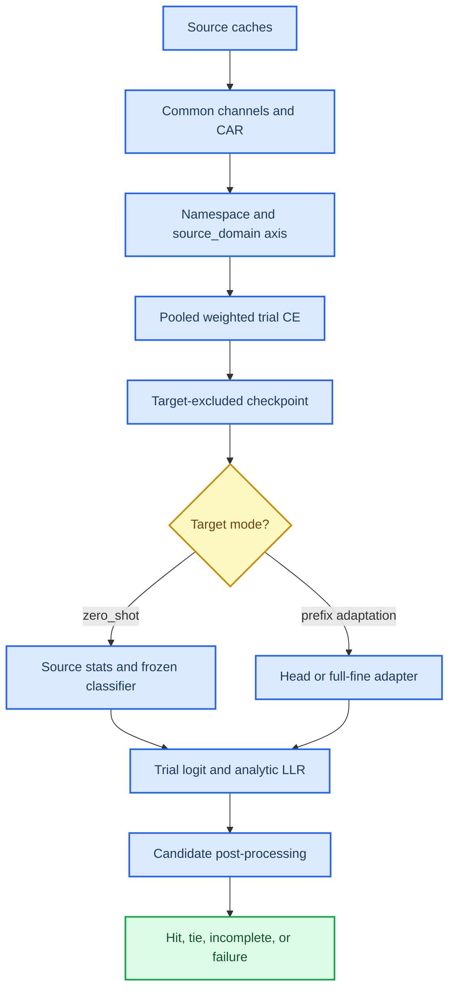
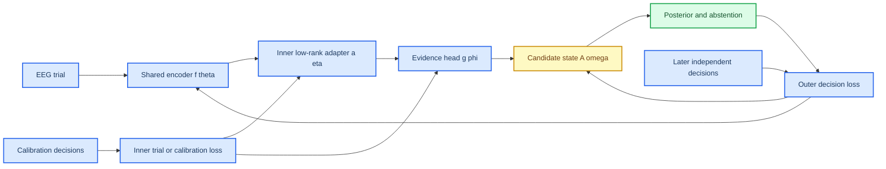

# 特征域对齐、双层学习与决策层重构科研-审计报告

_审计日期：2026-09-02 · 范围：D:\\BCI\\n2p3-net 当前工作树 · 性质：代码、合同、运行结果与方法可证伪性审计_

## 摘要

本报告回答三个问题：当前系统是否实现了特征域对齐；“把判别函数作为隐藏层并做双层学习”的设想是否在数学上成立；现有决策层为什么不能作为最终研究与产品接口。

结论是：**当前系统没有实现特征域对齐**。它实现的是共同通道 CAR、预处理/身份合同、显式 source-domain 风险加权，以及目标 prefix 上的分类头或全参数微调。这些机制能让输入可比较、训练可审计，但不会令不同数据域的潜在条件分布或判别方向相同。代码库中没有可执行的 MMD、CORAL、GRL/DANN、域判别器、域专属 stem 或域专属 head 默认路径。

“双层学习”是可行的，但必须严格定义为两种不同数据和目标上的嵌套优化：内层在 calibration episodes 上学习低容量目标适配器/证据判别器，外层在独立的 later decision 或 held-out domain 上优化共享表征和候选决策目标。如果内外层使用同一数据、同一损失，它只是普通端到端反向传播，不是有额外统计含义的 bilevel learning。卷积核是线性算子参数；非线性来自激活函数。把内层卷积核称为“非线性激活函数”在概念上不成立，除非明确采用 input-conditioned dynamic convolution，此时它是输入依赖的非线性算子而不是普通卷积核。

现有决策层也需要整体重构：训练优化的是逐 trial 二分类 CE，推理却使用候选内均值/累加和、row/column 特殊累积或多套后处理函数。它没有可学习的候选集合状态、没有显式的 abstain/continue 策略、没有不确定性模型，并且不同 runner 的中心化、计数和覆盖语义不一致。建议把系统重构为“共享表征 + 域/被试低秩适配器 + trial evidence/variance head + 可微候选集合累积器 + sequential posterior/abstention head”，并以合法的跨 decision 双层协议验证。

本报告的主证据来自当前源代码、工作树结果和已有研究文档；外部检索本轮未执行，因为 `EXA_API_KEY` 未配置。外部方法入口只作为可复核参考，不作为本项目性能结论的替代证据。

**关键词：** 特征域对齐、负迁移、双层优化、元学习、候选集合决策、P300、EEG

## 1. 审计问题与证据边界

### 1.1 审计问题

1. 当前跨数据集机制是否属于 feature/domain alignment，还是仅属于输入合同与风险加权？
2. 不同域的判别函数是否可以作为内层可学习对象，并通过外层候选决策损失反向优化共享表征？
3. 当前 trial-logit 到 9 选/row-column 决策的实现是否具有统一、可校准、可学习和可验证的语义？
4. 哪些现象已经由结果确认，哪些只是合理机制假设，下一步实验怎样区分它们？

### 1.2 证据分级

| 等级 | 含义 | 本报告实例 |
|---|---|---|
| A：直接代码证据 | 当前函数、调用链或状态枚举可直接确认 | CAR 适配、pooled CE、目标头微调、三套决策实现 |
| B：运行/制品证据 | 冻结结果或独立复算直接观察到 | `bnci_only > joint_*`，J1 恢复但仍低于 B0 |
| C：机制推断 | 由 A+B 与数学结构推出，尚需单轴实验 | 共享 stem/BN 的条件判别冲突是主要来源 |
| D：未验证方案 | 设计候选，不能写成已有效 | MMD/CORAL/GRL、per-domain stem、bilevel decision |

所有 D 级方案必须保留 `no-transfer`、单域 ceiling、域 LODO 和目标决策级主指标，不能只报告域分类准确率或 latent distance。

## 2. 当前实现的反向工程

### 2.1 实际代码链



### 2.2 输入层做了什么

`adapt_common_channel_average_reference()` 在 [`src/data/domain.py:41`](../src/data/domain.py:41) 选择声明的真实共同通道，并对每个 trial、每个时间点减去这些通道的瞬时平均值。其数学形式是

\[
x'_{c,t}=x_{c,t}-\frac{1}{K}\sum_{k\in\mathcal I}x_{k,t}.
\]

这可以消除一部分原始参考电极的公共偏移，并重新计算 QC 特征。它不估计或约束

\[
P_d(Z\mid Y),\quad P_d(Y\mid Z),\quad P_d(Z),
\]

也不保证不同设备、被试群体、刺激范式和电极空间扩散下的条件 ERP 形态一致。缺失通道、不兼容滤波/窗长和学习型空间映射仍然 fail-closed。多域准备脚本 [`experiments/prepare_multidomain_source.py:44`](../experiments/prepare_multidomain_source.py:44) 只串联 CAR、namespace、`source_domain` 和 cache 拼接；没有中间特征对齐模块。

### 2.3 多源训练做了什么

`N2P3NetBaseline.fit()` 在 [`src/baselines/deep.py:693`](../src/baselines/deep.py:693) 接收所有 retained source rows。默认 J0 是自然 epoch mass 的 weighted CE。显式 J1/J2 才用 `source_domain_mass` 生成 row multiplier；其实现位于 [`src/baselines/deep.py:96`](../src/baselines/deep.py:96)。

对域 \(d\) 和域内统计单位 \(u\)，当前权重可以写为

\[
r_i=\frac{(\sum_j c_j)\,\alpha_d}
{|U_d|\sum_{j\in(d,u)}c_j},
\qquad
L=\frac{\sum_i r_i c_{y_i}\operatorname{CE}_i}
{\sum_i c_{y_i}}.
\]

其中 \(c_y\) 是二分类 class weight，\(\alpha_d\) 是域质量质量分配。这个操作改变的是不同域进入共享参数梯度的比例，不改变共享参数的函数族，也不让域间的 latent class-conditional distributions 接近。

`selection_domain` 只限定 group-disjoint 的 inner validation/epoch selection 范围，见 [`src/baselines/deep.py:834`](../src/baselines/deep.py:834)。它不构成特征域对齐。

### 2.4 当前没有 feature alignment

在活动 `src/`、`experiments/` 和 `tests/` 中没有可执行的以下对象：

| 机制 | 当前状态 | 审计含义 |
|---|---|---|
| MMD / kernel mean matching | 未发现实现 | 没有 RKHS 分布距离约束 |
| CORAL / covariance alignment | 未发现实现 | 没有 latent covariance 约束 |
| GRL / DANN / domain classifier | 未发现实现 | 没有对抗域不可辨识目标 |
| conditional alignment | 未发现实现 | 没有按 class/candidate 对齐 |
| per-domain head | 未实现默认路径 | 所有域共享 classifier |
| per-domain stem/FiLM | 未实现 | 所有域共享空间/时间前端 |
| learned channel correspondence | 未实现 | CAR 不是空间对应学习 |

当前工作树新增的 [`src/research/domain_folds.py`](../src/research/domain_folds.py) 只构造 `domain_lodo` 和 `domain_ceiling` 的外层 fold。`src/baselines/evaluate.py` 的未提交改动只增加了 domain fold 形状验证；它没有把 domain ID 变成 feature alignment loss，也没有让 `DeepBaseline` 产生域专属参数。故“有 domain fold”不能写成“已经完成域迁移”。

### 2.5 目标域适配做了什么

`SubjectAdapterConfig` 在 [`src/transfer/subject_adapter.py:33`](../src/transfer/subject_adapter.py:33) 支持：

| 模式 | 实际更新 | 风险 |
|---|---|---|
| `zero_shot` | 不更新 trunk/classifier，使用 source stats | 不解决域偏移 |
| `classifier_fine` | 复用源 classifier，在 target prefix 上微调 | 小样本偏移 classifier |
| `linear` | 冻结 trunk，随机线性头 | 容易丢掉源判别坐标 |
| `mlp16` | 冻结 trunk，训练小 MLP | 容量和校准更不稳定 |
| `full_fine` | 更新 trunk 与 classifier | 高方差，可能破坏源表征 |

`input_statistics` 可选 source、target-prefix 或 shrinkage；`freeze_batchnorm_stats` 控制 full-fine 时是否更新 BN running statistics。它们是目标域统计/参数适配，不是对 source/target latent distributions 的显式约束。

## 3. 负迁移的审计结论

### 3.1 直接观察到的结果

BNCI-target causal-v3 CAR5 矩阵的 3-seed subject-macro 结果为（见 [`doc/research_status_report_20260902.zh.md:9`](research_status_report_20260902.zh.md:9)）：

| Arm | AUC | hit@8 |
|---|---:|---:|
| `bnci_only` (B0) | **0.6641** | **0.3417** |
| `joint_natural` (J0) | 0.5679 | 0.1222 |
| `joint_bnci80_epoch` (J1) | 0.6474 | 0.2736 |
| `joint_bnci80_participant` (J2) | 0.6496 | 0.2667 |

J0 相对 B0 的 hit@8 差为 `-21.94 pp`，J1 相对 J0 恢复 `+15.14 pp`，但 J1 仍比 B0 低 `-6.81 pp`；J2 与 J1 的差为 `-0.69 pp`。三个 seed 的排序一致：

\[
\mathrm{B0}>\mathrm{J1}\geq\mathrm{J2}>\mathrm{J0}.
\]

BI-target 归档方向同样显示自然联合负迁移，80/20 权重可恢复但未稳定超过单域。两个方向的合同和源组成不同，数值不能直接合并，但机制层证据同向。

### 3.2 主要机制解释：共享判别面折中

令域 \(d\) 的最优共享参数为 \(\theta_d^*\)，目标域为 \(t\)。当前训练近似求解

\[
\theta_{\mathrm{joint}}^*
=\arg\min_\theta\sum_d\alpha_d R_d(\theta).
\]

如果 \(R_t\) 与源域风险的最优方向不一致，则一般有

\[
R_t(\theta_{\mathrm{joint}}^*)
>
R_t(\theta_t^*).
\]

这不是优化器“没有跑完”，而是函数空间中共享参数的妥协成本。当前只读复审的 target-nontarget ERP contrast 余弦接近零或为负，尤其 P3/Pz/P4 方向接近反向。这与共享 temporal/spatial stem、MST branches、BN 和 classifier 的结构相容，但仍需要 matched gradient cosine 的直接测量才能把“共享梯度冲突”从 C 级推断升级为 A/B 级证据。

### 3.3 为什么域质量加权只能部分恢复

J1/J2 把 BNCI 的风险质量提高到 80%，减少了辅助域对目标方向的梯度暴露，所以 J0 -> J1 明显恢复。但标量 \(\alpha_d\) 只能选择折中点：

\[
\nabla R_{\mathrm{joint}}
=\sum_d\alpha_d\nabla R_d.
\]

它不能把相反方向的梯度变成互不干扰的参数子空间，也不能让一个 spatial filter 同时成为两个域的最优 filter。因此 J1 < B0 并不意外。

### 3.4 已排除或降级的解释

| 假设 | 当前证据 | 裁决 |
|---|---|---|
| 主要是 all-source mean/std 污染 | 固定训练预算、仅改 stats 的恢复约 `+0.07 pp` | 降级，非主因 |
| 主要是 inner validation 选错域 | v3 显式 `selection_domain=BNCI` 后仍受损 | 降级，不能解释剩余缺口 |
| epoch vs participant weighting 是关键 | J2≈J1 | 关闭该轴 |
| 训练步数不够 | 每 epoch 覆盖全部合法行，RTX 5090 运行完成 | 不支持 |
| candidate aggregation 单独造成全部损失 | AUC 与 hit 同时下降 | 不支持“全由后处理造成” |

### 3.5 仍需直接验证的机制

1. 匹配 source batch 上的 BI/BNCI gradient cosine 及其分布；
2. 共享 trunk、per-domain head、per-domain stem 的参数/梯度隔离比较；
3. source-only latent class-conditional MMD/CORAL 与 target decision 结果的关系；
4. BN frozen/adapt 对 feature statistics 和 target decision 的独立影响；
5. 域对齐是否消除了域信息，却同时损失了 P300 条件判别信息。

## 4. “判别函数隐藏层 + 双层学习”可行性审查

### 4.1 先区分三个概念

“隐藏层”“双层学习”“内层卷积核”不是同一件事：

| 说法 | 数学对象 | 是否等于 bilevel |
|---|---|---|
| 判别函数作为隐藏层 | `e=g_phi(f_theta(x))` | 否；普通网络分层 |
| 两层神经网络 | 多个可微层共同反传 | 否；通常是 single-level optimization |
| 双层学习 | 内层最优化的解进入外层目标 | 是；需要不同目标/数据或嵌套求解 |
| 卷积 kernel | 线性/仿射算子的参数 | 否；不是 activation |
| MMD kernel | RKHS 中的相似度函数 `k(z,z')` | 否；与卷积 filter 不同 |

因此，如果只是把现有 classifier 拆成“卷积层 + activation + linear layer”并一起反向传播，科学上不能称为双层学习。

### 4.2 严格的 bilevel 形式

定义共享特征抽取器 \(f_\theta\)、域/被试适配器 \(a_\eta\)、trial evidence 判别器 \(g_\phi\) 和决策聚合器 \(A_\omega\)。对一个 meta-target episode，calibration decisions 为 \(C_v\)，later independent decisions 为 \(T_v\)。

内层适配：

\[
(\eta_v^*,\phi_v^*)
=\arg\min_{\eta,\phi}
\mathcal L_{\mathrm{inner}}
\left(
g_\phi(a_\eta(f_\theta(X_{C_v}))),Y_{C_v}
\right)
 +\lambda_{\mathrm{reg}}\|\eta-\eta_0\|^2.
\]

外层元目标：

\[
\min_{\theta,\eta_0,\phi_0,\omega}
\sum_v
\mathcal L_{\mathrm{decision}}
\left(
A_\omega\left(
g_{\phi_v^*}(a_{\eta_v^*}(f_\theta(X_{T_v})))
\right),D_{T_v}
\right)
 +\lambda_{\mathrm{align}}\mathcal L_{\mathrm{feature-align}}.
\]

若使用 K 步 unroll：

\[
\phi_{k+1}=\phi_k-\alpha\nabla_\phi\mathcal L_{\mathrm{inner}},
\qquad
\eta_{k+1}=\eta_k-\alpha_\eta\nabla_\eta\mathcal L_{\mathrm{inner}}.
\]

外层梯度包含

\[
\frac{d\mathcal L_{\mathrm{outer}}}{d\theta}
=\frac{\partial\mathcal L_{\mathrm{outer}}}{\partial\theta}
 +\frac{\partial\mathcal L_{\mathrm{outer}}}{\partial\phi^*}
  \frac{\partial\phi^*}{\partial\theta}
 +\frac{\partial\mathcal L_{\mathrm{outer}}}{\partial\eta^*}
  \frac{\partial\eta^*}{\partial\theta}.
\]

如果用隐式微分，适配器解附近需要 Hessian-vector solve；小样本 EEG 上应优先使用低步数 unroll 或 first-order ablation，并记录是否截断二阶项。双层超参数优化和元学习的标准形式可参见[^4][^5]，但这些论文不构成本项目数据上的有效性证据。

### 4.3 这个设想什么时候有统计意义

只有同时满足以下条件，外层目标才不是自我验证：

1. 内层 calibration 与外层 test 是不同 decisions，且 target 改变；
2. outer decision labels 在训练阶段可见，但在最终产品 test 阶段不可见；
3. source/meta-train、held-out domain/meta-validation、final target test 的身份和时间边界明确；
4. inner 的适配容量受约束，不能用 3--5 个 decisions 学习整套 CNN；
5. outer 只使用独立 later decision 的候选损失，不能回看 inner suffix；
6. dynamic stopping、temperature、reliability weight 只在 inner/meta-validation 冻结。

GTN 同一 selection 的 prefix/suffix 共享 thought digit，只能做 O5 oracle proxy，不能作为这个 bilevel 方案的产品证据。BI2014a 的 early-known -> later-unknown cross-decision 可做机制验证；成人 BrainSync 多 session target-switch 才能做产品裁决。

### 4.4 “内层卷积核就是非线性激活函数”是否成立

普通离散卷积为

\[
(K*x)_t=\sum_\tau K_\tau x_{t-\tau},
\]

对输入 \(x\) 是线性的。普通卷积层加偏置后仍是仿射映射，非线性来自

\[
h_t=\sigma((K*x)_t+b).
\]

内层可以学习 \(K\)，例如

\[
K^{(k+1)}=K^{(k)}-\alpha\nabla_K\mathcal L_{\mathrm{inner}},
\]

但这只表示“内层更新卷积参数”。它不改变卷积本身的线性性质。

如果明确采用动态卷积：

\[
K(x)=K_0+U\,q_\eta(x),
\qquad
h=\sigma(K(x)*x),
\]

那么算子对 \(x\) 可能是非线性的。这应称为 input-conditioned/dynamic convolution 或 hypernetwork，不应称为“卷积核就是激活函数”。它还会引入高容量和可辨识性问题，当前不应作为第一版域适配主轴。

推荐的低风险实现是 domain/subject-conditioned low-rank adapter：

\[
K_d=K_0+U_dV_d^\top,
\quad
\|U_dV_d^\top\|\leq\rho,
\quad
h_d=\operatorname{ELU}(K_d*x).
\]

其中 \(K_0\) 由外层学习，\(U_d,V_d\) 在内层从 calibration 学习。它把“内层学习判别函数”变成可控的参数子空间隔离，而不是让一个小目标集重训全部 CNN。

### 4.5 推荐的双层结构



第一版不应同时启用 dynamic convolution、GRL、MMD、pseudo-label、full-fine 和 learned stopping。每增加一种自由度，就会改变可解释性和负迁移归因。

## 5. 特征域对齐的候选路线

### 5.1 先定义对齐对象

仅让边缘分布接近：

\[
P_s(Z)\approx P_t(Z)
\]

可能把不同类别混在一起；对 P300 更合理的候选是条件或结构化约束：

\[
P_s(Z\mid Y=c)\approx P_t(Z\mid Y=c),
\]

或仅约束 nuisance subspace，而不抹平与 target ERP 相关的方向。目标无真值时，class-conditional alignment 需要高置信 pseudo-label、source-only surrogate 或 calibration labels；不能把未经验证的 pseudo-label 当 ground truth。

### 5.2 候选方法与风险

| 方法 | 可优化目标 | 优点 | 主要失败模式 | 第一阶段结论 |
|---|---|---|---|---|
| CORAL | \(\|C_s-C_t\|_F^2\) | 简单、稳定、易记录 | 只对二阶统计，可能抹掉类差异 | 适合作为低风险统计对照 |
| MMD | RKHS 均值嵌入距离 | 可表达高阶边缘差异 | kernel/bandwidth 敏感，边缘对齐误伤 | 与 source CE 做单轴消融 |
| GRL/DANN | 目标域判别器不可辨识 | 直接针对 domain information | 删除 label-relevant domain signal，训练不稳 | 需强保留 no-align 与 conditional control |
| conditional MMD/DANN | 按 label/预测类别对齐 | 更接近 P300 条件结构 | target pseudo-label 错误会自强化 | 只在合法 calibration/高置信条件启用 |
| per-domain head | 共享 trunk + 域专属 classifier | 低容量隔离判别面 | unseen target 没有 head，需要 inner adaptation | 当前最优先单轴 |
| per-domain stem/FiLM | 域专属空间/时间适配 | 可修复 montage/filter 差异 | 参数多、身份/域捷径 | head 不足时再测 |
| gradient surgery | PCGrad/CAGrad 等 | 直接处理冲突梯度 | 目标函数解释复杂，可能损失有效共享 | 先做 cosine diagnosis，再单轴 |

MMD 中的 kernel 是相似度函数，例如 `k(z,z')`；它不是 `Conv1d` 的 temporal filter。这个名称重叠是当前设想中最需要避免的概念混淆。MMD、CORAL 与对抗域训练的原始方法分别见[^1][^2][^3]。

### 5.3 推荐的实现顺序

1. **F0：单域 ceiling**。每个域内部 subject-disjoint，确认域内模型上限。
2. **F1：当前 J0/J1/J2 复现**。固定唯一行、batch、optimizer step、seed 和 selection domain。
3. **F2：per-domain classifier head**。共享 trunk，目标域使用目标 head；source/meta episodes 内层只训练 head 或低秩 head adapter。
4. **F3：matched feature CORAL 或 MMD**。只加一个 alignment loss，系数预注册，保留 target decision loss。
5. **F4：class-conditional alignment**。仅在 labels 或高置信 pseudo-label 的合法范围运行。
6. **F5：per-domain stem/FiLM**。只有 F2--F4 说明共享前端仍是瓶颈时才进入。
7. **F6：bilevel adapter**。外层优化共享 trunk、adapter initialization 和 decision layer，内层执行固定步数 target calibration。

每一步都必须同时报告 target domain AUC、candidate hit@R、coverage、tie/abstain、决策延迟、domain probe accuracy、ERP morphology 和 adapter parameter count。latent distance 下降而 hit@R 下降时，应判为负迁移，不得晋升。

## 6. 当前决策层审计

### 6.1 训练目标与推理目标不一致

训练目标是 trial-level：

\[
\min_\theta\sum_i\operatorname{CE}(h_\theta(x_i),y_i).
\]

最终目标是 candidate/decision-level：

\[
\hat d=\arg\max_{d\in V}S_d(\{e_i:c_i=d\}).
\]

当前默认 `mean` 的 `S_d` 是候选内平均 logit；固定相同重复数时它与 sum 的 argmax 等价，但 all-evidence 计数不等时它只是 heuristic，不是由独立观测假设推出的 LLR。若输出被称为 LLR，严格的条件独立聚合应是 log-likelihood ratio 的加和；若使用 mean，应把它叫 count-neutral evidence score，不应继续把它当作概率意义上的 LLR。

### 6.2 决策实现分叉

当前至少存在以下三条路径：

| 路径 | 实现 | 聚合/中心化 | 使用位置 |
|---|---|---|---|
| 通用 subject-digit | [`src/models/decision.py:124`](../src/models/decision.py:124) `decide` | mean/sum/tempered，可 `center_logits`，默认函数值为 true | 旧 `run_eeg_loso` |
| generic candidate outcomes | [`src/transfer/evaluation.py:24`](../src/transfer/evaluation.py:24) 与 `:177` | mean/sum/trim/precision；没有同等的 group center 选项 | GTN/BrainSync transfer |
| row-column candidate outcomes | [`src/transfer/candidate_decision.py:82`](../src/transfer/candidate_decision.py:82) | 对 row/column 分别累加，要求唯一 row/column winner | BI row-column runner |

`evaluate_candidate_selection()` 在 [`src/baselines/evaluate.py:1346`](../src/baselines/evaluate.py:1346) 通过 `center_decision_logits` 控制中心化，CLI 默认是 false；而 `models.decision.decide()` 的 API 默认是 true。目标 transfer runner 直接调用 `candidate_evidence_endpoints()` 或 `candidate_decision_outcomes()`，并不统一经过 `DecisionResult`。

这不是单纯代码风格问题：不同路径对常数 classifier bias、候选计数、missing evidence、tie 和 score calibration 的解释可能不同，结果不能只看字段名而认为等价。

### 6.3 具体缺陷

#### 缺陷 D1：二分类非目标池化掩盖候选条件差异

trial head 学的是 target vs pooled non-target。若不同候选数字的视觉/电极/时序 nuisance 不同，则

\[
p(x\mid Y=0)=\sum_{d\neq d^*}p(x\mid C=d)P(C=d\mid Y=0)
\]

会把候选特异性差异压进一个 pooled negative distribution。随后对每个 candidate 求均值，并不等于直接比较 \(p(X\mid C=d)\)。这正是需要 candidate-set loss 或 candidate-conditional evidence model 的原因。

#### 缺陷 D2：mean 与 LLR 语义冲突

当前 `checkpoint_scores_to_llr()` 在 [`src/transfer/checkpoint.py:286`](../src/transfer/checkpoint.py:286) 做 weighted-CE offset correction；之后 `candidate_evidence_endpoints()` 又默认按 candidate mean 聚合。offset correction 的概率解释只对 trial score 成立，mean 只是计数修正启发式，不能自动继承完整 LLR 的独立证据解释。

#### 缺陷 D3：没有真正的 abstain policy

`DecisionStatus.ABSTAIN` 在 [`src/transfer/outcomes.py:20`](../src/transfer/outcomes.py:20) 定义，但当前决策函数没有产出 `ABSTAIN`；tie 使用 `TIE`，缺候选使用 `INCOMPLETE`。因此“无法判定”“明确并列”“证据不足”“模型 fit failure”没有统一的可学习或可配置策略。

#### 缺陷 D4：没有 sequential state 或继续采样价值

当前每个 evidence level 都是对前缀 trial 重新聚合，没有学习

\[
P(d\mid\mathcal E_{1:r}),
\quad
P(\text{stop now}),
\quad
P(\text{continue is worth its cost}).
\]

因此 hit@R 是事后曲线，不是一个经过成本约束训练的 sequential decision policy。

#### 缺陷 D5：缺少重复证据相关性模型

sum 隐含近似条件独立；mean 避免计数偏置但没有建模重复 trial 相关性。EEG 中 subject state、疲劳、block drift 和连续记录残差会让重复 evidence 相关，导致 sum 过度自信、mean 又缺少方差解释。

#### 缺陷 D6：覆盖语义在路径间不完全一致

`CandidateCoverage.complete` 要求 observed counts 不低于 expected 且不多于 expected；`candidate_evidence_endpoints()` 对 all-evidence 允许候选出现 excess，并另算 balanced prefix；row-column 路径又以 row/column 的完整性和唯一最大值为主。所有路径应统一为一个 `CandidateSetContract` 和一个状态机，否则同一个 result 的“complete”含义依赖 runner。

#### 缺陷 D7：z-score 不是概率置信度

`decide()` 输出的 subject-wise z-score 是 raw score 的单调标准化，argmax 不变。它可作诊断尺度，但不能被解释为 posterior confidence，也没有决定 abstain 阈值的统计校准。

#### 缺陷 D8：candidate vocabulary 缺少统一 fail-closed 边界

不同聚合入口对 vocabulary 的显式程度不同；应拒绝出现在输入中但不在 frozen vocabulary 的 candidate code，而不是只在桶聚合时静默忽略。

## 7. 决策层整体重构方案

### 7.1 统一对象模型

建议把当前后处理函数重构为四个显式对象：

| 对象 | 输入 | 输出 |
|---|---|---|
| `TrialEvidence` | `z_i`, `log_var_i`, candidate, repetition, time, QC weight | 单 trial 的证据与可靠性 |
| `CandidateAccumulator` | 一个 decision 的 evidence stream | 每候选 sufficient statistics 和 coverage |
| `DecisionState` | 前缀累计状态 | posterior、margin、entropy、abstain/continue |
| `DecisionOutcome` | frozen budget 下的最终状态 | prediction/status、coverage、cost、failure reason |

每一层都必须接收同一个 `CandidateSetContract`，并且所有 runner 复用同一个实现。

### 7.2 Trial evidence head

共享/适配后的 latent feature 为 \(z_i\)。evidence head 同时输出：

\[
(e_i,\log v_i)=g_\phi(z_i),
\qquad v_i=\operatorname{softplus}(\log v_i)+\epsilon.
\]

其中 \(e_i\) 可以是 calibrated binary evidence，\(v_i\) 是 train-only uncertainty/variance。不要把 `variance` 用 test correctness 反推。

### 7.3 候选累计与 posterior

对候选 \(d\) 累计：

\[
A_d=\sum_{i:c_i=d}w_i e_i,
\qquad
B_d=\sum_{i:c_i=d}w_i,
\qquad
Q_d=\sum_{i:c_i=d}w_i^2.
\]

如果采用异方差近似，可令 \(w_i=1/v_i\)，并记录

\[
n_{\mathrm{eff},d}=\frac{B_d^2}{Q_d}.
\]

有两种互斥的主模式：

**模式 P：概率证据模式。** 明确估计 target/non-target 的条件密度，候选分数使用 log-likelihood ratio 的和，并由候选先验和协方差修正控制过度累积。

**模式 D：判别集合模式。** 直接定义

\[
S_d=\rho_\omega(A_d,B_d,Q_d,\text{coverage}_d),
\qquad
P(d\mid\mathcal E)=\operatorname{softmax}_{d\in V}(S_d/\tau).
\]

模式 D 的 `S_d` 不应再被命名为 LLR；它是 candidate-set score。第一版建议同时保留 trial CE 作为正则项，但用 set-level CE 作为主要 decision objective。

### 7.4 候选集合损失

对完整候选集合和 evidence level \(r\)：

\[
\mathcal L_{\mathrm{set},r}
=-\log P(d^*\mid\mathcal E_{1:r}).
\]

总损失可写为

\[
\mathcal L
=\lambda_{\mathrm{trial}}\mathcal L_{\mathrm{trial}}
 +\lambda_{\mathrm{set}}\sum_{r\in R}\mathcal L_{\mathrm{set},r}
 +\lambda_{\mathrm{align}}\mathcal L_{\mathrm{feature-align}}
 +\lambda_{\mathrm{cal}}\mathcal L_{\mathrm{calibration}}
 +\lambda_{\mathrm{stop}}\mathcal L_{\mathrm{stop}}.
\]

`L_set` 只能对真实完整 candidate set 计算；缺失候选不能用 `-inf` 伪装成完整集合。若采用 row-column 任务，应显式选择：

\[
\mathcal L_{\mathrm{row-col}}
=\mathcal L_{\mathrm{row}}+\mathcal L_{\mathrm{column}},
\]

或用 36 个 row-column pair 的 joint softmax；两者不能在结果中混称为同一种 decision objective。

### 7.5 Sequential decision 与 abstention

在每个可用 evidence level 更新状态：

\[
q_r=F_\omega(q_{r-1},A_{1:|V|},B_{1:|V|},Q_{1:|V|},\text{coverage}_r).
\]

输出：

\[
(P_r(d),\;m_r,\;H_r,\;p_{\mathrm{stop},r},\;p_{\mathrm{continue},r}).
\]

其中 \(m_r\) 是 top-1 margin，\(H_r\) 是 entropy。固定预算产品主臂可以只用 `argmax + predeclared abstain threshold`；动态停止必须另设成本函数

\[
\mathcal L_{\mathrm{stop}}
=\text{decision error}+\lambda_t\text{time cost}
 +\lambda_s\text{stimulus cost},
\]

并在 calibration/meta-validation 冻结阈值。没有足够独立 decisions 时，不应把动态停止与域适配同时训练。

### 7.6 推荐的代码接口边界

```text
TrialEvidenceHead.forward(features)
    -> evidence, log_variance

CandidateAccumulator.update(evidence, variance, candidate_id, repetition)
    -> CandidateState

DecisionModel.forward(candidate_state, coverage, budget)
    -> posterior, prediction, abstain, continue_score

DecisionLoss.forward(trial_batch, candidate_state, target, mask)
    -> trial_loss, set_loss, calibration_loss, stop_loss

DecisionOutcomeBuilder.finalize(state, contract)
    -> typed outcome + operational cost + failure status
```

`run_within_subject_transfer.py`、`run_brainsync_cross_decision.py` 和 `run_candidate_cross_decision.py` 最终只负责构造合法 split、调用模型和保存 ledger，不再各自实现聚合规则。

## 8. 科研验证协议

### 8.1 域对齐与决策重构必须拆开

第一阶段只验证 feature alignment，不改变 decision objective：

| Arm | 共享表征 | 域对齐 | 决策层 |
|---|---|---|---|
| B0 | target/single-domain | 无 | 当前 frozen baseline |
| J0 | pooled multi-source | 无 | 当前 frozen baseline |
| H1 | shared trunk | per-domain head | 当前 baseline decision |
| A1 | shared trunk | CORAL 或 MMD 单轴 | 当前 baseline decision |
| A2 | shared trunk | conditional alignment | 当前 baseline decision |
| S1 | shared trunk + low-rank stem adapter | 无/显式 regularizer | 当前 baseline decision |
| D1 | shared trunk + domain head | 无 | 新 candidate-set decision |
| B1 | outer shared trunk + inner adapter | feature alignment 可选 | 新 candidate-set decision |

不得把 H1、A1、D1 一次性叠加后声称“迁移机制有效”。

### 8.2 外层 fold

需要同时报告：

1. `domain_ceiling`：同域 participant holdout，测域内上限；
2. `domain_lodo`：完整 held-out domain，测跨域能力；
3. target cross-decision：early known -> later unknown，测合法个性化；
4. final BrainSync target-switch：成人多 session，测产品 estimand。

当前未提交 `domain_folds.py` 已提供前两类 fold 构造的基础，但还没有与 feature alignment 训练和 result contract 闭合。

### 8.3 必须固定的变量

- source cache、source snapshot、checkpoint 和环境；
- 通道顺序、CAR、filter、epoch、单位、causal state；
- source rows、domain mass、batch、optimizer step、seed；
- inner selection domain 和 selection procedure；
- target calibration/test decision 边界和 embargo；
- candidate vocabulary、evidence budget、coverage 和 status denominator；
- trial/objective 权重和所有 alignment coefficient。

### 8.4 主要指标

主指标：

\[
\text{subject-macro operational hit@R}
\]

并将 requested participant/decision、coverage、tie、abstain、fit failure、刺激数和秒数全部计入报告。

支持性指标：trial AUC、BACC、candidate NLL、ECE、top-1 margin、entropy、domain probe accuracy、ERP morphology、gradient cosine、参数量和延迟。

### 8.5 关键反例与不变量

1. **candidate permutation**：同时重命名 candidate 与 truth，结果应不变。
2. **constant logit bias**：在不改变相对证据时，结果不应因候选计数产生伪偏置。
3. **candidate outside vocabulary**：必须 fail-closed。
4. **missing candidate**：状态必须是 incomplete/abstain，不能缩小候选集继续 argmax。
5. **exact tie**：必须 abstain 或 tie，不得按数字编码破 tie。
6. **same-selection leakage**：GTN O5 不能进入 product/meta outer result。
7. **pseudo-target arbitrary label**：任意指定 target 不得产生同样增益。
8. **alignment collapse**：domain probe 下降但 target hit@R 下降时，拒绝晋升。
9. **gradient sign**：记录每域梯度余弦分布，不引用 ERP cosine 代替梯度实验。
10. **decision loss equivalence**：在等重复数、单目标、无缺失的受限场景，candidate softmax 与相应聚合 argmax 应一致。
11. **causal prefix**：outer loss 不能看到 later test evidence 或未来滤波状态。
12. **cost monotonicity**：继续刺激的决策策略必须显式记录额外 stimuli/time，不能只报告 conditional accuracy。

## 9. 严重性排序与处理建议

| ID | 严重性 | 审计发现 | 对结论的影响 | 建议 |
|---|---|---|---|---|
| F-01 | Critical | 当前没有 feature-domain alignment | 不能称为特征域迁移 | 先实现并单轴验证 feature adapter |
| F-02 | Critical | pooled trial CE 与 candidate decision objective 错位 | trial AUC 不能替代 decision gain | 新增 candidate-set loss 和统一 accumulator |
| F-03 | Critical | 三套 decision path 语义分叉 | 不同 runner 的结果不可直接比较 | 统一 `DecisionModel`/`OutcomeBuilder` |
| F-04 | High | shared trunk/BN/classifier 可能承受冲突梯度 | 多源可系统性负迁移 | gradient cosine -> per-domain head -> stem |
| F-05 | High | bilevel 的内外数据边界尚不存在 | 容易把 oracle proxy 当真实迁移 | 先建立 cross-decision episodes |
| F-06 | High | `ABSTAIN` 枚举无实际生成策略 | 不确定性与失败语义混乱 | 增加 posterior/margin/coverage 状态机 |
| F-07 | Medium | mean 计数修正没有概率模型 | LLR 命名过强，重复证据相关性未处理 | 区分 probabilistic mode 和 discriminative score |
| F-08 | Medium | domain folds 尚未连接 feature training | 只能验证 fold，不产生对齐 | 补 model contract、训练和 tests |

## 10. 最终裁决

### 10.1 对当前系统的裁决

当前系统可以准确描述为：

> 显式物理输入合同下的多源监督训练与目标 prefix 适配框架。

不能准确描述为：

> 已完成的特征域对齐迁移学习系统。

“合同对齐”不是无用工作，但它回答的是“不同数据能否进入同一个 tensor/runner”，不是“不同域是否共享可迁移的判别表示”。当前负迁移结果说明后一个问题没有被解决。

### 10.2 对双层学习设想的裁决

该方向**理论上可行且值得研究**，但应改写为：

> 外层学习共享 EEG 表征、低秩适配器初始化和候选决策函数；内层在独立 calibration decisions 上学习目标域/被试证据适配器。

不应写成“内层卷积核就是非线性激活函数”。第一版推荐低秩 domain/subject-conditioned convolutional adapter 或 FiLM，而不是 input-conditioned dynamic kernel、全参数 inner fine-tune 和 pseudo-label 同时开启。

### 10.3 对决策层的裁决

决策层应被视为需要重构的研究模块，而不是继续在 `mean/sum/tempered` 上局部打补丁。重构的核心顺序是：

1. 统一 candidate-set contract、coverage 和 outcome state machine；
2. 把 trial evidence、variance/reliability 和 candidate accumulation 变成可追踪对象；
3. 引入 candidate-set loss，使训练目标接近最终 decision；
4. 再加入 posterior、abstention 和 cost-aware sequential policy；
5. 最后才把它接入 bilevel domain adaptation。

在上述闭环完成并通过 cross-decision 和 domain-LODO 反例前，任何“迁移提升”“域不变”“双层学习有效”都只能是研究假设，不能写成确认性或产品结论。

## 参考入口

### 本地一手证据

- [`src/data/domain.py`](../src/data/domain.py)：共同通道 CAR、namespace、source-domain axis。
- [`experiments/prepare_multidomain_source.py`](../experiments/prepare_multidomain_source.py)：多源 cache 构建链。
- [`src/baselines/deep.py`](../src/baselines/deep.py)：pooled CE、域风险权重和 shared trunk 训练。
- [`experiments/run_pretrain_supervised.py`](../experiments/run_pretrain_supervised.py)：source inner selection 与 full refit。
- [`src/transfer/subject_adapter.py`](../src/transfer/subject_adapter.py)：目标 head/full fine、normalization 和 BN 行为。
- [`src/models/decision.py`](../src/models/decision.py)：旧 subject-digit 后处理决策。
- [`src/transfer/evaluation.py`](../src/transfer/evaluation.py)：generic candidate evidence 聚合。
- [`src/transfer/candidate_decision.py`](../src/transfer/candidate_decision.py)：row-column 累积。
- [`doc/research_status_report_20260902.zh.md`](research_status_report_20260902.zh.md)：BNCI-target 负迁移矩阵和机制分析。
- [`doc/research_program.zh.md`](research_program.zh.md)：当前估计量、证据边界和下一门实验。

### 外部方法入口

本轮 Exa 学术检索因未配置 `EXA_API_KEY` 未执行；以下为方法的可复核入口，不代表本项目已验证这些方法：

[^1]: Gretton et al.，A Kernel Two-Sample Test，JMLR：<https://jmlr.org/papers/v13/gretton12a.html>。

[^2]: Sun and Saenko，Deep CORAL，arXiv：<https://arxiv.org/abs/1607.01719>。

[^3]: Ganin et al.，Domain-Adversarial Training，JMLR：<https://jmlr.org/papers/v17/15-239.html>。

[^4]: Franceschi et al.，Bilevel Programming for Hyperparameter Optimization and Meta-Learning，arXiv：<https://arxiv.org/abs/1806.04991>。

[^5]: Finn et al.，Model-Agnostic Meta-Learning，arXiv：<https://arxiv.org/abs/1703.03400>。

[^6]: Ben-David et al.，domain adaptation theory，DOI：<https://doi.org/10.1007/s10994-009-5152-4>。

_本报告不修改训练、迁移或决策代码；当前工作树中原有的用户改动保持不变。_
