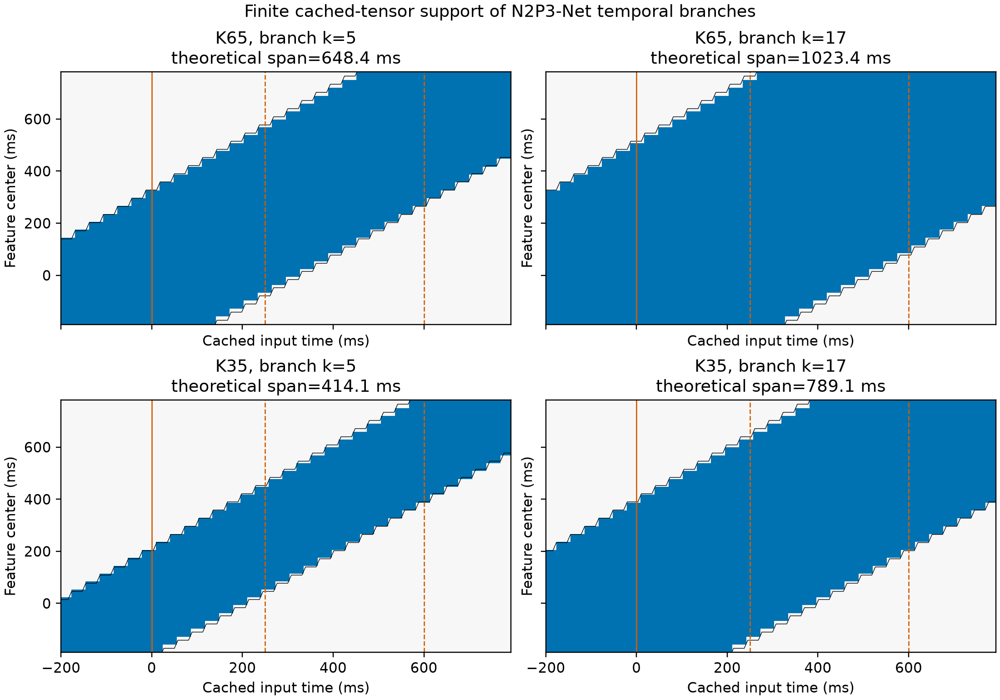

# N2P3-Net 总感受野专项研究

_日期化机制审计，2026-08-28；不改变当前模型结构或默认配置_

状态：test-ready research appendix。科研状态与 GTN 晋升仍由
[`research_program.zh.md`](research_program.zh.md) 管理。

---

## 摘要

当前 `R_s = K0 + (P-1) + (Ks-1)P` 公式没有 off-by-one；问题是项目曾把
MST 局部 kernel span、branch 端到端 RF、有限 epoch 内实际支持、最终 logit 的
全局 union 和训练后有效感受野混成一个概念。

在 128 点缓存输入上，K65 两支的理论 branch RF 是 84/132 点，即
648.44/1023.44 ms。长支没有任何 feature 真正拥有完整 132 点非 padding 支持，
但中央 `j=15,16` 已覆盖全部 128 点。K35 将两支缩到 54/102 点，即
414.06/789.06 ms，恢复了一部分局部性，但没有恢复 LMBC 的 pre/post 窗口语义：
K35 长支的每个 LMBC contrast 仍结构性覆盖整段缓存，K35 短支经过所有 latency
candidate 的正权混合后也覆盖整段。

更重要的是，`full_unfold`、`ms_flatten`、global average 和 LMBC 的最终 logit
理论 union 都是全 epoch。K35 若有收益，合理主张只能是“更局部的中间基函数带来
有限样本归纳偏置”，不能说最终模型只看 414/789 ms。现有 K35 开发轨迹还同时改变
参数量和 padding 比例，因此不能把性能变化归因于 RF。

推荐先做 RF-preserving、parameter-preserving 和 tap-density 分离的机制矩阵，保存
训练 checkpoint 后测 `.eval()` 推理态 ERF；只允许一个冻结候选进入 GTN。

## 1. 研究问题与对象边界

### 1.1 五层依赖必须分开

| 层级 | 输入到输出 | 当前支持性质 | 可否称生理 raw RF |
|---|---|---|---|
| Acquisition filter | 连续 EEG -> filtered EEG | 四阶 IIR 理论无限；zero phase 双向，forward 仅过去 | 否 |
| Epoch transform | source epoch -> 128 点 cache | FFT resample 理论全 epoch；baseline 耦合全部 pre-stim 点 | 否 |
| Branch structural RF | cache -> 单个 MST feature | 推理态有限，可精确计算 | 只能称 model-input RF |
| Readout/logit RF | 全部 features -> trial logit | dense/平均 readout 的 union 为全 epoch | 否 |
| Decision RF | 多 trial -> candidate decision | 跨 repetitions 与 selection | 否 |

本报告的精确支持图只回答第三、第四层。第一、第二层在
[`preprocess.py`](../src/data/preprocess.py) 中先连续 IIR，再 epoch-domain FFT resample，
最后执行 baseline subtraction。SciPy 的 Fourier resampling 本身使用全局 Fourier
表示，因此不能把一个 resampled sample 解释成有限 source-sample 窗。[^1]

### 1.2 理论 RF 不等于有效 RF

理论 RF 只表示“存在计算路径”；训练后实际影响由卷积权重、非线性、BN、readout 和
输入决定。Luo 等人把高梯度质量集中区称为 effective receptive field，并指出它通常
小于理论支持域。[^2] 因此本报告把 `structural support` 和 `trained ERF` 分开。

### 1.3 训练态和推理态也不同

推理态 BatchNorm 使用冻结 running statistics，不扩展单个 feature 的时间支持。训练态
BatchNorm1d/2d 的均值和方差跨 batch 与全部时间位置计算，所以一个训练输出对同 batch
其他位置存在直接梯度依赖。[^3] RF/ERF 部署审计必须使用 `.eval()`、FP32、关闭 dropout；
训练态全局耦合另作优化问题，不能混入推理 RF 表。

## 2. 精确递推

设缓存索引 `n=0..127`，时间为

```text
t(n) = -200 + 1000 n / 128  ms.
```

卷积/池化 RF 的标准递推可由 convolution arithmetic 得到。[^4][^5] 对当前网络：

```text
layer                    jump J       RF R       center offset
input                       1            1            0
ST same conv K0             1           K0            0
spatial conv                1           K0            0
avgpool P=4                 4         K0+3          1.5
MST same conv Ks            4    K0+3+4(Ks-1)      1.5
```

所以

```text
R_s = K0 + (P - 1) + (Ks - 1)P
    = K0 + 4Ks - 1,              when P=4.

D_s = 1000 (R_s - 1) / 128 ms.
```

令 `a=(K0-1)/2`、`b=(Ks-1)/2`，第 `j` 个 branch feature 的中心与有限输入
实际非 padding 支持闭区间为

```text
center(j) = 4j + 1.5
S_j = [max(0, 4j-4b-a), min(127, 4j+4b+3+a)].
```

分析脚本 [`analyze_receptive_field.py`](../experiments/analyze_receptive_field.py) 用布尔依赖
矩阵逐层传播；独立 autograd 对 K35/K65 的 `2 x 2 x 32 = 128` 个 branch
coordinates 全部复核，无 mismatch。

## 3. K65 与 K35 的有限输入支持

| K0 / Ks | 理论 RF | endpoint span | 完整理论 RF 的 j | 平均实际/理论支持 |
|---|---:|---:|---|---:|
| 35 / 5 | 54 | 414.06 ms | 7..24 | 89.47% |
| 35 / 17 | 102 | 789.06 ms | 13..18 | 80.09% |
| 65 / 5 | 84 | 648.44 ms | 10..21 | 83.63% |
| 65 / 17 | 132 | 1023.44 ms | 无 | 74.24% |



_图 1：有限缓存输入支持域。底层数据见
[`receptive_field_support.csv`](assets/receptive_field_20260828/receptive_field_support.csv)，
完整 LMBC/readout summary 见
[`receptive_field_support.json`](assets/receptive_field_20260828/receptive_field_support.json)。_

### 3.1 中央 feature 并不局部

以 `j=15`，feature center 约 280.47 ms 为例：

| 配置 | cache 支持 | 对应时间 |
|---|---|---|
| K35 / k5 | 35..88 | 73.44..487.50 ms |
| K35 / k17 | 11..112 | -114.06..675.00 ms |
| K65 / k5 | 20..103 | -43.75..604.69 ms |
| K65 / k17 | 0..127 | -200.00..792.19 ms |

K65 长支把“中心在 P300 附近”变成“整个 cache 的全局形态”。这不一定降低分类，
但它不再是可解释的局部 P300 尺度。

### 3.2 padding 不是边缘小问题

K65/k17 的理论 RF 为 132，大于输入 128，所以每个位置都使用 zero padding；中央
位置虽覆盖全部真实输入，仍缺少理论窗的外部点。K35/k17 也只有 6/32 个位置获得
完整 102 点支持。位置本身因此编码了不同 padding fraction，dense `full_unfold`
可能利用这一边界模式。

K65 可以通过把 ST kernel 外侧 15+15 个 taps 置零精确模拟 K35。因此 K35 的函数族
是 K65 的子集；若 K35 泛化更好，原因不可能是表达能力更强，只能来自有限样本
正则化、优化、较少参数、较少 padding 或这些因素的组合。

## 4. readout 后的 RF

### 4.1 `ms_flatten` 不是四个独立 250 ms 窗

pool8 在 branch feature 轴上再增加 `(8-1)*4=28` 个 input samples 的理论 RF：

| K0 / Ks | 理论 readout RF | 四个 bin 的实际 cache 支持 |
|---|---:|---|
| 35 / 5 | 82 | `0-56, 7-88, 39-120, 71-127` |
| 35 / 17 | 130 | `0-80, 0-112, 15-127, 47-127` |
| 65 / 5 | 112 | `0-71, 0-103, 24-127, 56-127` |
| 65 / 17 | 160 | `0-95, 0-127, 0-127, 32-127` |

K65 长支中间两个 bin 都覆盖整段 cache，四个 bin 还高度重叠。因此 `full_unfold`
相对 `ms_flatten` 的 BI2014a 增益可以解释为保留位置相关基函数，但不能简单表述为
“去掉四个 250 ms 独立窗”。MS-EEGNet 原文支持多尺度 temporal branches 作为候选，
但其跨数据结果并非一致胜过 EEGNet。[^6][^7]

### 4.2 final logit union 对所有模式都是全 epoch

`full_unfold` 的 linear classifier 连接全部 32 个位置；`ms_flatten` 连接全部四个 bin；
global average 和 LMBC 也聚合多个位置。只要相应权重不为零，其结构 union 都是
`0..127`。所以比较 K65/K35 时，真正可检验的是 **局部 basis RF 和训练后 ERF 质量
分布**，不是 final-logit 是否全局。

## 5. LMBC 窗口语义的反例

LMBC 依据 feature center 选择：

```text
reference:  j=0..6
delta -100: j=11..22
delta  -50: j=13..23
delta    0: j=15..25
delta  +50: j=16..26
delta +100: j=18..28
```

但 reference features 的真实 cache 支持是：

| 配置 | 名义 reference | 实际 cache 支持时间 |
|---|---|---|
| K35 / k5 | -200..0 ms | -200..+206.25 ms |
| K35 / k17 | -200..0 ms | -200..+393.75 ms |
| K65 / k5 | -200..0 ms | -200..+323.44 ms |
| K65 / k17 | -200..0 ms | -200..+510.94 ms |

K65 两支的每个 candidate-reference contrast 都覆盖全 128 点；K35 长支也是如此。
K35 短支中 `delta=0,+50,+100` 的 contrast 已全覆盖，而所有候选经严格正 softmax
混合后 summary 的 union 仍是全 cache。

最强直接反例是 cache sample 34，即 `+65.625 ms`。它既不属于 `[-200,0)`，也不
属于最早从 +150 ms 开始的任何名义 candidate raw window，但在确定性 unit-weight
K35 LMBC 中，最终 logit 对该点的 gradient 非零，并且 128/128 个时间点均非零。
专项测试已把这个反例编码在
[`test_receptive_field_analysis.py`](../tests/test_receptive_field_analysis.py)。

结论是：**当前 LMBC 的 feature-coordinate mask 正确，但 raw/model-input window
解释不成立。** 这否定当前实现的局部语义，不否定 latency marginalization 理念。
单试次 latency realignment 文献仍支持把受限时移作为候选，但它不能替代分类与
候选级 matched 验证。[^8]

## 6. source-domain RF 更宽

### 6.1 连续 IIR

四阶 Butterworth IIR 理论 impulse response 无限。`phase=zero` 前后向滤波在刺激前后
都有依赖；`phase=forward` 只依赖过去，但仍是无限递减支持。因此 648/1023 ms
只能称 cache-input architecture span，不能称 acquisition-raw span。

### 6.2 epoch FFT resampling

当前 `epochs.resample(method="fft")` 是全 epoch Fourier resampling。内部冲激测试中，
513 点 source epoch 的单点冲激在 128 个输出点上全部产生非零值。理论上每个 cache
sample 对整个 source epoch 有依赖；阈值化“有效支持”必须另外声明幅值/能量容差。

### 6.3 baseline subtraction

128 Hz 下 `[-200,0)` 包含 cache indices `0..25`。对所有 `t`：

```text
X_t = Ehat_t - (1/26) sum_(b=0..25) Ehat_b.
```

即便没有 FFT resampling，每个 baseline-corrected sample 也与全部 26 个 pre-stim
samples 耦合。卷积权重和为零时可能发生数值抵消，但结构上不能假定。

## 7. 待检验假设与竞争解释

### H-RF：K35 的收益来自更局部的 basis

预测：在参数、tap 数、feature rate 和 readout 匹配后，缩短 RF 仍改善 inner-subject
泛化与 jitter robustness；训练后 logit ERF 的 `r90` 变窄，branch ERF 分离增加。

### H-PARAM：收益只是较少参数的正则化

预测：同参数预算的 broad-RF arm 与 local-RF arm相当；或把 K65 正则到同等有效自由度
即可复现 K35。

### H-PAD：收益来自降低 padding 依赖

预测：扩展上下文后再 crop、reflection padding 或 valid-window readout 会缩小 K65/K35
差异；性能与 padding fraction 比 RF span 更相关。

### H-FACT：收益来自层间 kernel 分配/优化

预测：RF、参数量都相同，仅把 taps 从 shared ST 移到 branches，性能仍变化；此时
“总 RF”不是充分解释。

### H-NOISE：当前 K35 只是自适应开发选择

预测：在 paired seeds 和未参与 K 搜索的 inner folds 上差异不稳定。现有本地仓库没有
可独立复核的 K35 screening records，所以该竞争解释尚未排除。

## 8. 最小 matched 机制矩阵

首轮不直接寻找最佳 kernel，只检验三个 planned contrasts。所有 arm 固定
`T=128,P=4,F=8,D=2,M=2,full_unfold`；`d` 表示 ST dilation。

| Arm | K0 / d / branches | branch RF | 参数 16ch / 3ch | 角色 |
|---|---|---:|---:|---|
| A | 65 / 1 / 5,17 | 84,132 | 1506 / 1298 | 当前 broad reference |
| B | 35 / 1 / 5,17 | 54,102 | 1266 / 1058 | 当前 K35 bridge |
| C | 33 / 1 / 5,17 | 52,100 | 1250 / 1042 | local support |
| D | 33 / 2 / 5,17 | 84,132 | 1250 / 1042 | same taps, broad support |
| E | 33 / 1 / 13,25 | 84,132 | 1506 / 1298 | same RF/params as A |

Planned contrasts：

1. `C vs D`：相同 taps、参数、feature rate，仅改变 dilation support，是 RF 主检验；
2. `D vs A`：相同 RF，改变 coefficient density/参数量；
3. `E vs A`：RF、参数、feature rate 相同，只改变 shared/branch 分配。

`B` 只连接既有开发轨迹，不承担单独机制裁决。dilation 会产生格点混叠，必须先用
奇偶交替输入反例验证；若它导致不可接受 aliasing，改用无 dilation 的二阶段矩阵：

| RF pair | K0 / branches 方案 1 | K0 / branches 方案 2 | 参数 16ch / 3ch |
|---|---|---|---:|
| 36,68 | 25 / 3,11 | 17 / 5,13 | 1058 / 850 |
| 44,60 | 25 / 5,9 | 17 / 7,11 | 1058 / 850 |

该 2x2 在相同 RF pair 内检验 factorization，在相同参数预算下检验 RF scale 分布。

`(49,9,21)` 与 `(33,13,25)` 都能保持 A 的 `84/132` RF 与总参数量；只在
`E vs A` 显示层间分配效应后才增加中点，不进入首轮。

## 9. ERF 测量协议

当前 records 不保存 trained checkpoint，所以本轮只能证明 structural support，不能
给出训练后 ERF。后续每个 inner fold 保存 checkpoint，并在未用于训练的 audit rows 上：

```text
m(x) = target_logit - nontarget_logit
e_t  = sum_c (partial m / partial X_c,t)^2
p_t  = e_t / sum_t e_t.
```

对 branch coordinate 和 final logit 分开报告：

- `r50/r90`：包含 50%/90% gradient mass 的最短连续区间；
- 质心、标准差、entropy、pre-stim mass、250-600 ms mass；
- branch 间 Jensen-Shannon divergence，检验多尺度是否实际分离；
- padding fraction 与 edge mass；
- `+/-31/62/125 ms` shift、远端伪相关反转和局部 occlusion 曲线；
- target/non-target、正确/错误、所有 subjects，不能只挑正确 trial。

程序性 positive control 是 unit-weight model，其 Jacobian support 必须与 JSON 完全一致；
negative controls 是 random weights、label shuffle、时间反转和远端伪相关反转。Integrated
Gradients/occlusion 作为正交方法；单一 saliency 图不能决定机制。

## 10. 实验与停止规则

1. BI2014a 只作 grouped inner development，使用 paired folds、相同 QC、相同 updates、
   相同初始化映射和至少 3 seeds；不再读取其 outer result 做晋升。
2. 先跑 A/C/D/E 和 B bridge，只检验三个 planned contrasts；seed 先在 subject 内聚合。
3. 若 `C vs D` 不改善泛化或 jitter，停止“K35 因局部 RF 获益”的解释。
4. 若 `E vs A` 有差异，转向 factorization/optimization；总 RF 不能单独解释。
5. 若 B 只在参数、延迟、内存上非劣，称工程压缩，不称科学 RF 改进。
6. 只冻结一个 RF 候选进入 GTN；GTN 前必须先让 evaluator 真正输出 subject-macro
   `hit@R`。当前 `evaluate_candidate_selection()` 尚未消费 `repetition_indices`，不能用
   overall hit 冒充 `hit@5`。
7. 最小有意义差值、非劣界和样本精度在看到新结果前预注册；本报告不从已用 BI outer
   数字反推方便阈值。

## 11. 对当前路线的判定

- **保留** K35 为桥接候选，但撤销任何“已证明 RF 更合理”的表述；
- **保留** K65 作为 broad reference，它的表达集合包含 K35；
- **停止** 用 local MST kernel span 解释完整 branch；
- **停止** 把 LMBC feature mask 称为 raw pre/post isolation；
- **暂不修改** 当前模型结构，先完成 matched mechanism matrix 和 trained ERF audit；
- **最终仍由 GTN 裁决**，但只有在 `hit@R` evaluator、cache、reference 和 normalization
  Gate 0 闭合后才能运行。

## 参考文献

[^1]: SciPy Developers. "`scipy.signal.resample`: Resample using Fourier method." https://docs.scipy.org/doc/scipy/reference/generated/scipy.signal.resample.html

[^2]: Luo, W., Li, Y., Urtasun, R., & Zemel, R. (2016). "Understanding the Effective Receptive Field in Deep Convolutional Neural Networks." _NeurIPS_. https://arxiv.org/abs/1701.04128

[^3]: PyTorch Contributors. "BatchNorm1d." https://docs.pytorch.org/docs/stable/generated/torch.nn.BatchNorm1d.html

[^4]: Araujo, A., Norris, W., & Sim, J. (2019). "Computing Receptive Fields of Convolutional Neural Networks." _Distill_. https://doi.org/10.23915/distill.00021

[^5]: Dumoulin, V., & Visin, F. (2016). "A Guide to Convolution Arithmetic for Deep Learning." _arXiv preprint_. https://arxiv.org/abs/1603.07285

[^6]: Lawhern, V. J. et al. (2018). "EEGNet: a compact convolutional neural network for EEG-based brain-computer interfaces." _Journal of Neural Engineering_. https://doi.org/10.1088/1741-2552/aace8c

[^7]: Borra, D., Fantozzi, S., & Magosso, E. (2021). "A Lightweight Multi-Scale Convolutional Neural Network for P300 Decoding." _Frontiers in Human Neuroscience_. https://doi.org/10.3389/fnhum.2021.655840

[^8]: Quattrociocchi, I. et al. (2026). "Improving P300 morphology through single-trial latency realignment." _Journal of Neural Engineering_. https://doi.org/10.1088/1741-2552/ae7766
